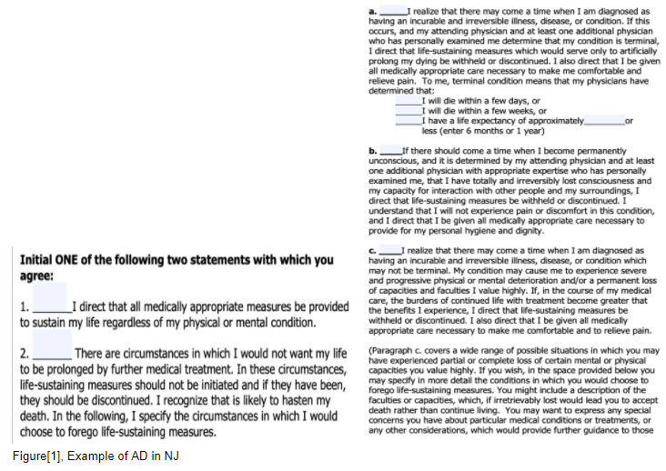

# Final Project Proposal

**Project URL**: http://35.194.73.188/

**Name of project:** Better planning for fatal times 

**Track:** Model Track

**Group Members:** Weiqin Wang, Yifan Song, Seungmyung Lee, Eileen Wang

**Introduction**

Modern medicine has made significant progress in prolonging human life. However, there are still times when patients and their families are in a situation where they need to make a decision for receiving life-sustaining treatments (LST) or not. In these urgent and stressful experiences, patients in need of End-of-life (EOL) care may be cognitively unavailable to make an informed decision. To avoid being unprepared to make such an important decision, some people leverage the Advance Care Planning (also known as ACP). The ACP allows people to review their care options consciously ahead of time, and select the care they would like to receive if a fatal event occurs. It is important to note that the ACP does not attempt to be a decision-making tool. Rather, it is an opportunity for the patient to proactively plan for the worst case scenario. In the best case scenario right now, ACPs can represent a patient’s wishes in the time of need, in the form of a written description for family and medical professionals. 

**The problem we are addressing for...**

**The patient**: The ACP itself has several limitations. First, the patient’s process of filling in the ACP is very manual and difficult to digest. Second, ACPs may not address every possible EOL care scenario, and therefore lead the patient to go through an unpreferred outcome. 

**The proxy decision maker**: It is found that most patients do not participate in ACP in the US [3]. When ACPs are not in place, EOL care decisions are left to be made by someone who is best able to represent the patient’s interests called a proxy decision maker. The proxy decision maker is usually a family member or friend. The decision made by the proxy may or may not reflect what the patient would have wanted. Being the proxy decision maker is also very stressful (you don’t know if you are making the right decision) and potentially expensive (legal implications and medical fees).   

**Our goal in this project is to minimize the consequences of insufficient care planning, by providing a solution for both the patient and the proxy maker. For the patient, our solution will be a user-friendly survey experience with only the most relevant questions. For the proxy decision maker, our solution will provide informed decision(s) through a machine learning model for consideration.** We think there is an opportunity to use AI/machine learning to determine the unique lists of questions to survey the patients to better elicit the patients’ EoL decision preferences. The proposed model could alleviate a lot of the laborious answer collection process from patients and also show them information along the way of how their answers will inform their eventual decision. 

**Proposed solution overview**

We aim to develop a web-based application with a machine learning-based backend. There are two types of users: 

1) A patient looking to document their preferences

2) A proxy decision-maker looking to consider an EoL decision for the patient. We consider two possible use cases here. A. Only provide the questions chosen by active learning and the answers given by the patients to the proxy decision-maker, but no inference on the model end. Therefore, in this case, the EoL decision inference will fully be conducted by the proxy decision-maker. B. The machine learning model will output predicted decision(s) for their(proxy decision-maker) consideration. The ethical concern lies in whether utilize machine inference or fully rely on human inference. However, the final inference for case B will still be left for the proxy decision-maker to do. 

**Workflow of 1st type of user: A patient**
First, the interface will allow users to log in to the system and input relevant demographic and healthcare information. Then, the application will leverage an active learning approach to dynamically sample the most important questions for users to answer based on their responses and specific context. The user goes through and answers all the questions. At the end of the workflow, the app will document and summarize the user’s preferences. 

Background research and considerations: We found that there are existing solutions such as the Advance Directive collecting consent from patients in the below format. However, it is not iterable depending on patient context, and patients may spend a lot of time processing questions that may not be relevant to them. With our solution, we hope to present the most pressing questions to the patient in a prioritized order.

On the technology front, an example of preference elicitation is the MIT Moral Machine[1]. However, MIT Moral Machine does not show the model inference process, making it challenging for users to trust the inference made by the machine. We hope to seek ways to utilize visualization to share with the patient what the machine interpretation of the learned user's utility functions are, so that humans can trust the application to infer in their best interest. 

**Workflow for 2nd type of user: The proxy decision maker Case B (Case A is straightfoward)**
The application will first ask the user to input the patient’s demographic and health information(features used in the survey). The user confirms, and the model will output predicted decision(s). We will remind the user that this is only a recommendation, and by no means an option they must consider. 

Considerations: We will try to make predictions of patient decisions based on the aggregation of data using methods such as matrix factorization. The predicted set of decisions will then be presented to family and friends (individuals that may play the role of the proxy decision maker) as a possible option for them to make. Such an approach may however incur possible ethical concerns. For example, how might we avoid encoding human bias or misrepresent the minority group? For now, we believe that certain design patterns could alleviate such drawbacks. For example, ask the patients to evaluate the model predictions on previously unseen questions. We look forward to discussing our approach and challenges in the final writeup. 

**Scope of the project** 

The dataset we will use is mainly composed of features from the International Classification of Functioning, Disability, and Health (ICF). We will group possible features by potential diseases. The number of questions to ask the patient will be exponential to the number of features. For example, a combination of 10 binary features ( 10 C 1, …, 10 C 10) will result in a total of 1,023 questions. For the scope of this project, initially we will start by picking one potential disease and find 10 related binary features, which aligns well with the current advanced directive form (as shown in Fig1). The patients will answer a total of 30 dynamically chosen questions. Then, we will select 30 additional questions to show machine prediction of the user’s response. Some possible visualizations to be shown to the user during the question-and-answer process are plots with the feature ranking of the model (e.g. the essential features that lead to the model prediction). We will find ways to encode human responses (if they agree/disagree with the machine interpretation) to the model as well, so that the machine could integrate the responses into the training process. 

For the back-end of the application, the active learning and visualization will be developed using Python.We will first create an active learning baseline using a simple entropy/maximum model change based approach with logistic regression. We will integrate the domain knowledge by adding constraints to the gradidents updates. Then we will build the prototype using the baseline active learning model. From the front-end of the application, we intend for the user to interact with a survey to dynamically affect how the model responds. To do this, we will create a web-based model that allows the users to login to the system and answer a series of questions selected by the active learning model. The prototype will be developed before Nov 19 the Final project design review. 

References:
[1] Awad, E., Dsouza, S., Kim, R. et al. The Moral Machine experiment. Nature 563, 59–64 (2018). https://doi.org/10.1038/s41586-018-0637-6

[2] D. Mcelfresh, S. Dooley, C. Cui, K. Griesman, W. Wang, T. Will, Neil Sehgal, J. Dickerson. (2020). "Can an Algorithm Be My Healthcare Proxy?." AAAI International Workshop on Health Intelligence.

[3] Rao, J.K., Anderson, L.A., Lin, F.C., Laux, J.P.: Completion of advance directives among us consumers. American journal of preventive medicine 46(1), 65–70 (2014)
