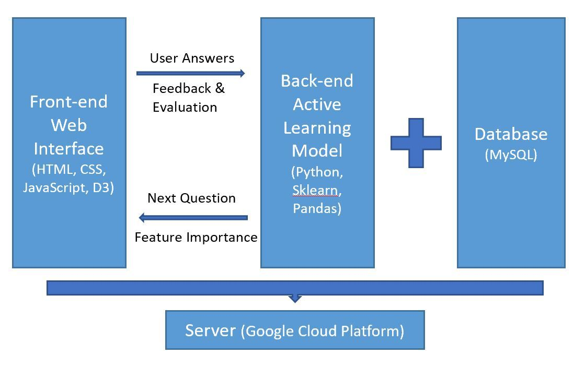
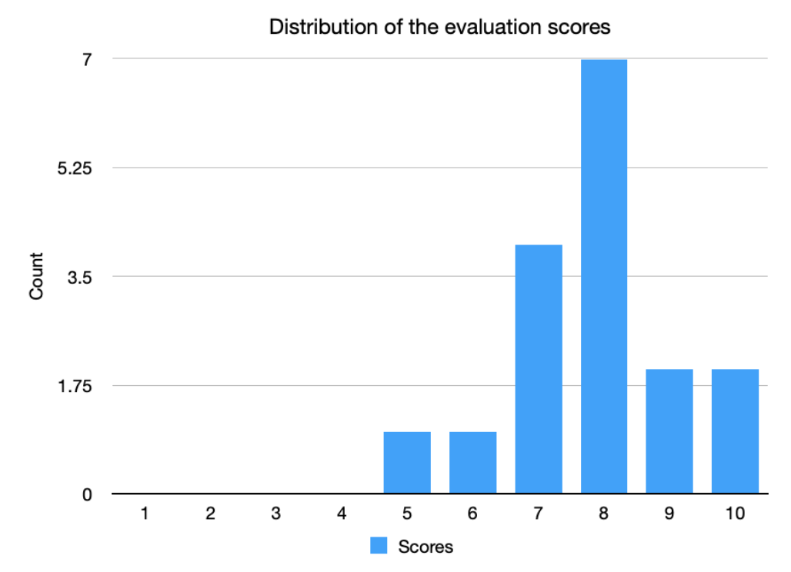
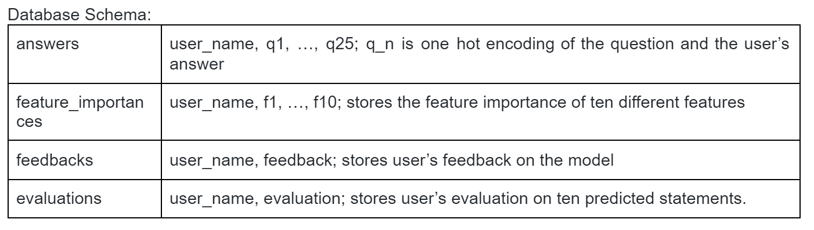

# Planning for fatal times - Final Report

**Project URL**: http://35.194.73.188/

Healthcare patients sometimes need to make critical life decisions in moments where they are cognitively unavailable to do so. This is why the Advance Care Planning (ACP) is created: It is a tool to document ahead of time patient preferences in whether to receive life-sustaining treatments or not in various scenarios. However, the current experience of filling out an ACP is manual and difficult to digest for the patient. The ACP also may not address comprehensive scenarios for whether to receive life-sustaining treatments or not. The goal of our project is to address these limitations, by building a user-friendly survey experience that leverages active learning and generates accurate predictions of patient preferences in different scenarios. We aim to alleviate the stress in filling out an ACP, while helping patients run through as many scenarios as possible with the help of machine learning. 

## Introduction
Modern medicine has made significant progress in prolonging human life. However, there are still times when patients and their families need to make a decision for receiving life-sustaining treatments (LST) or not. In these urgent and stressful experiences, patients in need of end-of-life (EOL) care may be cognitively unavailable to make an informed decision. To avoid being unprepared to make such an important decision, some people leverage the Advance Care Planning (also known as ACP). The ACP allows people to review their care options consciously ahead of time, and select the care they would like to receive if a fatal event occurs. The ACP is not a decision-making tool. Rather, it is an opportunity for the patient to proactively plan for the worst case scenario. In the best case scenario, ACPs can represent a patient’s wishes in the time of need, in the form of a written description for family and medical professionals. While the ACP works well in theory, in practice there are significant challenges. For the patient, the process of filling in the ACP is very manual and difficult to digest. Second, ACPs may not address every possible EOL care scenario, and therefore lead the patient to go through an unpreferred outcome.

Our motivation in this project is to help the ACP deliver the most value to patients. We’ll do so by addressing the user experience of the survey itself, and proactively anticipating comprehensive scenarios that could be relevant to the patient through a machine learning model. We will use active learning to determine the unique lists of questions to survey the patients to better elicit the patients’ EoL decision preferences. The proposed model could alleviate a lot of the laborious answer collection process from patients. The model will also predict preferences to additional scenarios based on the patient’s past responses, to help the ACP documentation be even more comprehensive.

## Related Work
We studied prior applications that explore machine’s role in supporting human decision-making, and experiments that used random forest as a basis for active learning. The Moral Machine looks at challenges encountered in the process of setting ethical principles that should guide the development of artificial intelligence (Awad, Dsouza, Kim, Schulz, Henrich, Shariff, Bonnefon, Rahwan, 2018). In addition to the complexities that exist in teaching machines how to behave within societal-level expectations of ethics, it is also difficult to represent individual preferences and values (McElfresh, Dooley, Cui, Griesman, Wang, Will, Sehgal, Dickerson, 2020). To evaluate the most suitable machine learning methods to advance the current ACP process, we reviewed prior applications of active learning algorithms built on logistic regression (Yang and Loog, 2014).

## Methods
**Active Learning Model**
We used 10 binary features that each describe a condition that forces patients to be in a physically or cognitively challenged state to make decisions. The number of questions to ask the patient is exponential to the number of features. Thus, we have a total of 1,023 possible questions to ask patients(excluding all 0 cases). The active learning model is based on random forest using an entropy approach. In each round, the model will sample the instance from the data pool that maximizes the entropy. In this prototype, we asked the users to answer 25 dynamically sampled questions, which is a very small portion of the total 1023 questions. 

**Domain Constraints and Data Augmentation**
The domain constraints can be used for data augmentation during the process. If a question is composed of features A,B,C and the participants answers “yes” to this question, then any question that is composed by a subset of {A,B,C} should also result in “yes” eg: AB, AC. Similar transitivity is also present in the “no” answer. If a participant answers “no” to a question ABC then any questions that contain ABC should also result in “no”, eg: ABCD. The constraints result from the facts that the features we chose are all disease symptoms. The use of transitivity assumes the users are rational about their answers, where in practice the users can be inconsistent sometimes during the survey and evaluation stage.. 

**Model Selection, Use and Feature Importance Measure**
In the ideal case, if the human are rational, the decision boundary would be linear. Due to the nature of our application, the model interpretation plays an important role in the survey process. Because of the scale of the dataset and the domain-specific need, we believe traditional machine learning methods such as Logistics Regression, SVM, and Random Forest are well-suited for this problem. Given the limited development time and resource, we don’t have the data and time to apply cross-validation for model selection. However, we provide a thorough discussion on the potential model selection process, challenges and intuition. 

By the nature of application, traditional cross validation with accuracy metrics will incur fairness concern. The accuracy metrics itself cannot ensure model performance across the general population. We believe that the objective in the model selection is to ensure a certain accuracy guarantee for individual participants, thus encouraging more uniform performance across the general population. Therefore, certain ideas from the fair resource allocation domain can be borrowed such as alpha-fairness to construct more suitable evaluation metrics. 

We noticed certain models such as Logistic Regression can be modified to capture the domain knowledge through constraints updates on the parameters. For example, enforcing the weights to be non-positive, and bias to be non-negative can automatically capture the domain constraints. Intuitively, the users would only select receive life-sustaining care by the bias term, and the features weights would result for EoL decision. 

In this prototype, we choose Random Forest as the predictive model to be consistent with the feature importance graph. In each round, the feature importance graph is displayed using Random Forest by measuring the change of gini-impurity. Additionally, the Random Forest model is a tree-based ensemble method which is a natural choice for determining the rule-based decision making in our application.  However, in order to better understand the model behavior and select the most appropriate model, we need access to more data and conduct more experiments. 

**Evaluation methods**
At the end of the survey, patients are asked how many of the predicted responses they agree with. We purposely chose to have the patient answer how many predicted answers they agreed with overall instead of remarking on each prediction, because we did not want the patient to feel overwhelmed with having to evaluate each feature independently as well as dependently based on other features in each question. 

Currently the number of questions to survey the patient and evaluate were determined arbitrarily for this prototype. However moving forward, we propose to include a human in the loop training process. The training loop will be an iterative process of survey and evaluation, until the model prediction matches the participant’s expectations.  

**Architecture**
**Web application and visualization** 
Our front-end is a web application built with JavaScript, HTML, and CSS. The visualization is created using D3. The web application is the primary interface for users to interact and is designed to be clear and easy to complete with straightforward instructions. It passes the users’ answers to the back-end and database for sampling the next question, and then storing the answers. It will also pass users’ feedback and evaluation for us to improve the model and better design our product. On the front-end, there is a feature importance plot for each question, in which the patient can leverage to better understand the current attribute weight our model is using. It provides a general visual impression about the model’s current status. The animated visualizations update in real-time during the survey process from the feature importance matrix generated from our back-end.

**Database and server**
MySQL is used to store unique patient answers to each of the dynamically-chosen questions. The answers are stored for patients to reference at any point. Collected answers are also aggregated to make predictions of patient decisions, using methods such as matrix factorization. On MySQL database, 4 tables are created to store each user’s data (see appendix for schema). All parts of our application are deployed on a GCP server with a public address, which means any user can access the survey simply through a browser without any other requirements.

Fig 2: Diagram of full-stack application functions architecture

## Results
**Patient workflow in web application**
In the web application, patients will first answer 25 questions with binary features. Patient selects “agree” or “disagree”, and clicks “Next question” to record their preference. Along with each subsequent question, a bar chart will visualize how the model is currently accounting for each feature’s importance. As the patient answers more questions, the importance score will change in real-time. The answers to the 25 dynamically chosen questions are used to train the model. Next, 10 questions are presented in one screen with the machine’s predicted preferences for the patient. Patient is asked to evaluate whether the predicted preferences accurately reflect their needs. There is also a text feedback box for the patient to provide any additional comments about the application experience. 

**Patient evaluation of model**  
Gaining patient trust is a key part of the model evaluation. After showing 10 predicted preferences, we ask the patient how many of the predicted preferences they agree with. The intention is to ensure our model is outputting predicted preferences that are aligned with what patients would want. Our model has been evaluated by 17 different users. The distribution of the scores show that the model is making successful attempts at predicting the user’s preference, with mean value of 7.82 and standard deviation of 1.28.

Fig 2: Accuracy of model predictions reported by users

**Feedback for application**
Another critical component to evaluating the success of this application is whether it provides a better experience for patients than manually filling out an ACP. At the end of the survey experience, we ask patients to provide text feedback to gather their thoughts. 

The feedback we received spanned across UI,UX, logic behind model, model visualization, and the general survey experience. For UX, users wanted to be able to return to prior questions, and know how they are progressing in the survey. From a readability standpoint, it would also help them better comprehend the questions if there were lines to divide each feature. On the model itself, users reported that it was challenging to evaluate features without having more information on their own circumstances. For example, knowing their economic status could be a deciding factor that sways their answer from “Yes” to “No”, and vice versa. For the bar chart visualization, they wanted a caption that could help provide context to the machine’s interpretation. Some also reported that they felt that seeing how the bar heights were changing was influencing how they made their next decision. Finally, it would be informative for the users if they could see a final visualization at the last page, to summarize what the machine has documented and learned. Overall, a feedback that was consistent across users is that they felt the survey encouraged them to learn more about their own priorities. One user commented, “I was surprised that I actually would not want to continue receiving medical care for many cases. It was a very interesting survey.” We were able to act on many of the feedback received in the next deployment. 

## Discussion
The initial goal for this application is to encourage patients to plan ahead on critical life decisions. We set out to ease their anxiety by developing a solution that simplifies the documentation process, minimize ambiguity around patient intent, and present informed guidance for proxy decision makers. In many ACP products in the market, patients have multiple conversations and repetitively enforce their intentions across different stakeholders— medical professionals, patients’ family members, and lawyers, to name a few. From an efficiency perspective, our web application enables patients to document their intent in a straightforward manner, especially given complicated health circumstances. 

On the other hand, from an ethical perspective patients may question whether their documented preferences are accurately representing their needs, or influenced by the machine’s predicted responses. We knew we wanted to make informed deployment choices that support patients’ decision-making process, rather than attempt to dictate decisions for patients. However, while creating the application there were times where it was challenging to decide whether certain interface and algorithm designs are unintentionally influencing patients’ decision-making. In the initial 25 questions posed for patients to train our model, we debated whether we should allow patients to skip question(s). If the patient skips questions, our model risks training on insufficient amounts of data and can overfit. Therefore we currently don’t offer the option to skip, but this means that patients may not be absolutely certain about each response they put forth.

Additionally, in an effort to simplify the prompts in which patients respond to, our model uses transitivity properties to interpret patient preferences. While from a user experience perspective it saves the patient a lot of time in processing answers, this may mean that the machine is not very sensitive in interpreting patient preferences. Patient conditions and needs are hard to generalize, and while transitivity could account for many observations, there may still be edge case preferences that are hard to predict for. These considerations make it challenging to assess the model’s accuracy in recording patient preferences.  

## Future Work
**Help patients plan for diverse circumstances**
Currently there are only 10 features used by the model and are shown to patients. In order to document an even more comprehensive understanding of patient decisions in diverse circumstances, we would want to add more features. The more features we add, the better we can help patients plan for any scenario they may find themselves in. 

**Improve model performance by collecting more data**
The model is currently only trained and evaluated with data we collected from 17 users. Once we have more data, methods such as collaborative filtering can be used to better predict user intents of patients with similar utility functions. However, such methods also incur potential ethical concerns such as mis-represent minority groups.

## Appendix
**Database schema**

**Features**

Features:
"One sided body paralysis ",
"Impaired voice, unable to speak coherent words ",
"Impaired eating requiring use of a feeding tube ",
"Imparied vision ",
"Impaired cognitive ability such as severe memory loss, difficulty expressing yourself,   difficulty reasoning ",
"Impaired perception and orientation to surroundings ",
"Impaired self-care ability, e.g. difficulty dressing yourself " ,
"Incontinence " ,
"Impaired control of emotions ",
"Impaired sexual ability "

